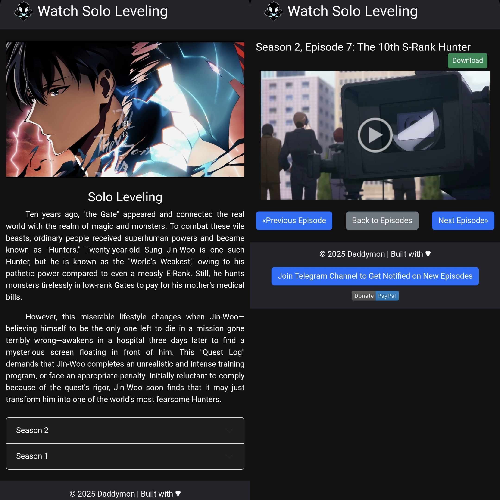

# Solo Leveling Anime Website


Welcome to the **Solo Leveling Anime Website**, your one-stop destination for exploring the thrilling world of **Solo Leveling**. Stream episodes, read summaries, and get the latest updates—all in one place. You can also install the website on your mobile device for quick access!

## 🌟 Website Link

Visit the live site here: [Solo Leveling Anime Website](https://enosiii.github.io/Solo-Leveling/)

---

## 📜 Features

- 📖 **Plot Summary**: Learn about the gripping story of Sung Jin-Woo, the weakest Hunter turned into one of the world's strongest.
- 📺 **Seasons and Episodes**: Browse through the latest episodes of Solo Leveling.
- 📱 **Progressive Web App (PWA)**: Install the website on your phone for offline access.
- 🔔 **Episode Notifications**: Join our [Telegram Channel](https://t.me/SoloLevelingStream) to stay updated on new releases.
- 🎨 **Modern Design**: A sleek, responsive interface built with **Bootstrap 5** and **Google Fonts**.

---

## 🛠️ Installation Instructions

### 1. Install the Website on Your Phone
1. Visit the live site: [Solo Leveling Anime Website](https://enosiii.github.io/Solo-Leveling/).
2. On your mobile browser:
   - For **Android (Chrome)**: Tap the three dots menu > "Add to Home Screen".
   - For **iPhone (Safari)**: Tap the Share button > "Add to Home Screen".
3. Access the app from your home screen anytime!

---

## 💾 How to Run Locally

### Prerequisites:
- A web browser
- Internet connection (for initial setup)

### Steps:
1. Clone the repository:
   ```bash
   git clone https://github.com/enosiii/Solo-Leveling.git
   ```
2. Open the `index.html` file in your browser:
   ```bash
   cd Solo-Leveling open index.html
   ```
4. Enjoy exploring Solo Leveling!

---

## 📸 Screenshots

### Home Page


### Plot Summary


---

## 🔖 Tags for SEO and Searchability
- Solo Leveling
- Solo Leveling Arise from the Shadow
- Solo Leveling Season 2
- Watch Anime Online
- Easy to Download Solo Leveling
- Solo Leveling Episodes
- Sung Jin-Woo
- Solo Leveling Story
- Progressive Web App Anime
- Solo Leveling Streaming
- Best Anime Websites 2025

---

## 💬 Feedback and Contributions
We welcome feedback and contributions! To report issues or suggest new features:
- Open an [issue](https://github.com/enosiii/Solo-Leveling/issues)
- Create a pull request with your improvements

---

## 👩‍💻 Technologies Used
- **HTML5**: For building the web structure
- **CSS3**: For styling and layout
- **Bootstrap 5**: For responsive design
- **JavaScript**: For interactive features
- **Service Worker**: To enable offline support
- **GitHub Pages**: For hosting the website

---

## 📜 License
This project is licensed under the MIT License. See the [LICENSE](LICENSE) file for more information.

---

## 📣 Acknowledgments
- **Manhwa Inspiration**: Solo Leveling by Chu-Gong
- **Icons and Thumbnails**: Custom images sourced from the `episode-thumbnails` folder

---

### ✨ Built with 💖 by [EnosIII](https://github.com/enosiii)

